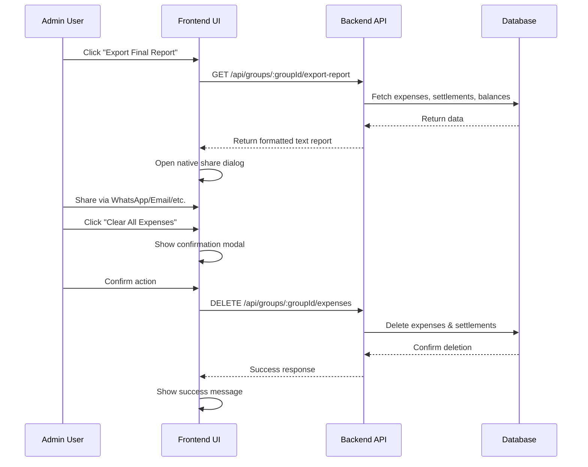

# Design Document: Export Final Expense Report & Clear Records

## Overview

This feature enables Admin users to export a complete expense summary as plain text using the native Web Share API before clearing all expense records for a group. The design prioritizes simplicity by leveraging existing browser capabilities and avoiding database storage or PDF generation.

## Main Algorithm/Workflow



## Core Interfaces/Types

### Backend Types

```typescript
// Report generation response
interface ExpenseReportResponse {
  report: string;  // Formatted plain text report
  generatedAt: Date;
}

// Clear expenses response
interface ClearExpensesResponse {
  success: boolean;
  message: string;
  deletedExpenses: number;
  deletedSettlements: number;
}

// Internal report data structure
interface ReportData {
  groupName: string;
  expenses: Array<{
    date: Date;
    payerName: string;
    amount: number;
    category: string;
    title: string;
    participants: string[];  // Names of members + guests
  }>;
  balances: Array<{
    name: string;
    netBalance: number;
  }>;
  settlements: Array<{
    fromName: string;
    toName: string;
    amount: number;
  }>;
}
```

### Frontend Types

```typescript
// Share API types
interface ShareData {
  title?: string;
  text?: string;
  url?: string;
}

// Component props
interface AdminControlsProps {
  groupId: string;
  isAdmin: boolean;
}

interface ConfirmClearDialogProps {
  open: boolean;
  onOpenChange: (open: boolean) => void;
  onConfirm: () => Promise<void>;
}
```

## Key Functions with Formal Specifications

### Backend: generateExpenseReport()

```typescript
async function generateExpenseReport(groupId: string): Promise<string>
```

**Preconditions:**
- `groupId` is a valid MongoDB ObjectId
- Group exists in database
- User making request is authenticated

**Postconditions:**
- Returns formatted plain text report as string
- Report includes all expenses, balances, and settlements for the group
- No data is modified or deleted
- Report format matches specification (group name, expenses list, final balances)

**Loop Invariants:**
- For expense iteration: All processed expenses maintain chronological order
- For balance calculation: Sum of all net balances equals zero (accounting identity)

### Backend: clearAllExpenses()

```typescript
async function clearAllExpenses(groupId: string, adminId: string): Promise<ClearExpensesResponse>
```

**Preconditions:**
- `groupId` is a valid MongoDB ObjectId
- `adminId` is a valid MongoDB ObjectId
- User with `adminId` has role 'admin' for the group
- Group exists in database

**Postconditions:**
- All expenses with `groupId` are deleted from database
- All settlements with `groupId` are deleted from database
- All expense audit records with `groupId` are deleted from database
- Group document remains unchanged (name, members, admin)
- User documents remain unchanged
- Returns count of deleted records
- Operation is atomic (all-or-nothing via transaction)

**Loop Invariants:** N/A (bulk delete operations)

### Frontend: handleExportReport()

```typescript
async function handleExportReport(groupId: string): Promise<void>
```

**Preconditions:**
- `groupId` is defined and non-empty
- User is authenticated
- User has admin role for the group
- Browser supports Web Share API (navigator.share exists)

**Postconditions:**
- API call to backend is made
- On success: Native share dialog is opened with report text
- On error: Error toast is displayed to user
- No state mutations occur

**Loop Invariants:** N/A (no loops)

### Frontend: handleClearExpenses()

```typescript
async function handleClearExpenses(groupId: string): Promise<void>
```

**Preconditions:**
- `groupId` is defined and non-empty
- User is authenticated
- User has admin role for the group
- User has confirmed the action via dialog

**Postconditions:**
- API call to backend is made
- On success: Success toast is displayed, expense list is refreshed
- On error: Error toast is displayed
- Confirmation dialog is closed

**Loop Invariants:** N/A (no loops)

## Algorithmic Pseudocode

### Report Generation Algorithm

```typescript
ALGORITHM generateExpenseReport(groupId)
INPUT: groupId of type string
OUTPUT: formattedReport of type string

BEGIN
  ASSERT groupId is valid ObjectId
  
  // Step 1: Fetch all required data
  group ← await Group.findById(groupId)
  ASSERT group !== null
  
  expenses ← await Expense.find({ groupId })
    .populate('paidBy', 'name')
    .populate('sharedWith', 'name')
    .populate('guestParticipants', 'name')
    .sort({ createdAt: 1 })
  
  balances ← await computeGroupBalances(groupId)
  settlements ← await simplifyDebts(groupId)
  
  // Step 2: Build report header
  report ← "Group: " + group.name + "\n\n"
  
  // Step 3: Format expenses section
  report ← report + "Expenses:\n"
  FOR each expense IN expenses DO
    ASSERT expense.paidBy !== null
    
    date ← formatDate(expense.createdAt, "dd-MMM-yyyy")
    payer ← expense.paidBy.name
    amount ← formatCurrency(expense.amount)
    title ← expense.title OR expense.category
    
    report ← report + date + " " + payer + " paid " + amount + " for " + title + "\n"
    
    // Add participants
    participants ← []
    FOR each member IN expense.sharedWith DO
      participants.add(member.name)
    END FOR
    FOR each guest IN expense.guestParticipants DO
      participants.add(guest.name)
    END FOR
    
    report ← report + "  Split among: " + participants.join(", ") + "\n"
  END FOR
  
  // Step 4: Format balances section
  report ← report + "\nFinal Balances:\n"
  FOR each settlement IN settlements DO
    ASSERT settlement.amount > 0
    
    fromName ← settlement.fromName
    toName ← settlement.toName
    amount ← formatCurrency(settlement.amount)
    
    report ← report + fromName + " owes " + toName + " " + amount + "\n"
  END FOR
  
  // Step 5: Add generation timestamp
  report ← report + "\nGenerated on: " + formatDate(now(), "dd-MMM-yyyy HH:mm")
  
  ASSERT report.length > 0
  RETURN report
END
```

**Preconditions:**
- groupId exists in database
- All referenced collections (Group, Expense, User, GuestParticipant) are accessible
- computeGroupBalances and simplifyDebts functions are available

**Postconditions:**
- Report contains all expenses in chronological order
- Report contains all outstanding settlements
- Report is formatted as plain text
- No database modifications occur

**Loop Invariants:**
- Expense loop: All processed expenses are included in report in order
- Participant loop: All participants (members + guests) are collected
- Settlement loop: All settlements with positive amounts are included

### Clear Expenses Algorithm

```typescript
ALGORITHM clearAllExpenses(groupId, adminId)
INPUT: groupId of type string, adminId of type string
OUTPUT: result of type ClearExpensesResponse

BEGIN
  ASSERT groupId is valid ObjectId
  ASSERT adminId is valid ObjectId
  
  // Step 1: Verify admin permissions
  admin ← await User.findById(adminId)
  ASSERT admin !== null
  
  group ← await Group.findById(groupId)
  ASSERT group !== null
  ASSERT group.adminId.equals(adminId)
  
  // Step 2: Start database transaction
  session ← await startSession()
  session.startTransaction()
  
  TRY
    // Step 3: Delete all expenses
    expenseResult ← await Expense.deleteMany(
      { groupId: new ObjectId(groupId) },
      { session }
    )
    deletedExpenses ← expenseResult.deletedCount
    
    // Step 4: Delete all settlements
    settlementResult ← await Settlement.deleteMany(
      { groupId: new ObjectId(groupId) },
      { session }
    )
    deletedSettlements ← settlementResult.deletedCount
    
    // Step 5: Delete all expense audit records
    await ExpenseAudit.deleteMany(
      { groupId: new ObjectId(groupId) },
      { session }
    )
    
    // Step 6: Commit transaction
    await session.commitTransaction()
    
    // Step 7: Log action
    logger.info("Cleared expenses for group " + groupId + " by admin " + adminId)
    
    RETURN {
      success: true,
      message: "All expense records have been cleared successfully.",
      deletedExpenses: deletedExpenses,
      deletedSettlements: deletedSettlements
    }
    
  CATCH error
    // Rollback on any error
    await session.abortTransaction()
    THROW error
    
  FINALLY
    await session.endSession()
  END TRY
END
```

**Preconditions:**
- groupId and adminId are valid ObjectIds
- Admin user exists and has admin role for the group
- Database connection is active

**Postconditions:**
- All expenses for group are deleted OR transaction is rolled back
- All settlements for group are deleted OR transaction is rolled back
- All expense audits for group are deleted OR transaction is rolled back
- Group and user documents remain unchanged
- Operation is atomic (all deletions succeed or all fail)

**Loop Invariants:** N/A (bulk operations)

### Frontend Share Report Algorithm

```typescript
ALGORITHM handleExportReport(groupId)
INPUT: groupId of type string
OUTPUT: void (side effect: opens share dialog)

BEGIN
  ASSERT groupId !== null AND groupId !== ""
  
  // Step 1: Show loading state
  setIsExporting(true)
  
  TRY
    // Step 2: Fetch report from backend
    response ← await fetch("/api/groups/" + groupId + "/export-report")
    
    IF response.status !== 200 THEN
      THROW new Error("Failed to generate report")
    END IF
    
    data ← await response.json()
    reportText ← data.report
    
    ASSERT reportText.length > 0
    
    // Step 3: Check if Web Share API is available
    IF navigator.share === undefined THEN
      // Fallback: copy to clipboard
      await navigator.clipboard.writeText(reportText)
      showToast("Report copied to clipboard")
      RETURN
    END IF
    
    // Step 4: Open native share dialog
    await navigator.share({
      title: "Expense Report",
      text: reportText
    })
    
    showToast("Report shared successfully")
    
  CATCH error
    IF error.name === "AbortError" THEN
      // User cancelled share dialog - not an error
      RETURN
    END IF
    
    showToast("Failed to export report: " + error.message)
    
  FINALLY
    setIsExporting(false)
  END TRY
END
```

**Preconditions:**
- groupId is valid
- User is authenticated
- User has admin role

**Postconditions:**
- Report is fetched from backend
- Share dialog is opened OR report is copied to clipboard
- Loading state is reset
- User receives feedback via toast

**Loop Invariants:** N/A (no loops)

## Example Usage

### Backend Route Registration

```typescript
// In routes/group.routes.ts
router.get(
  '/:groupId/export-report',
  authMiddleware,
  adminOnlyMiddleware,
  groupController.exportReport
);

router.delete(
  '/:groupId/expenses',
  authMiddleware,
  adminOnlyMiddleware,
  groupController.clearAllExpenses
);
```

### Backend Controller Implementation

```typescript
// In controllers/group.controller.ts
export async function exportReport(req: Request, res: Response, next: NextFunction) {
  try {
    const report = await svc.generateExpenseReport(req.params.groupId);
    ok(res, { report, generatedAt: new Date() });
  } catch (e) {
    next(e);
  }
}

export async function clearAllExpenses(req: Request, res: Response, next: NextFunction) {
  try {
    const result = await svc.clearAllExpenses(req.params.groupId, req.user._id);
    ok(res, result);
  } catch (e) {
    next(e);
  }
}
```

### Frontend Component Usage

```typescript
// In components/AdminControls.tsx
export function AdminControls({ groupId, isAdmin }: AdminControlsProps) {
  const [isExporting, setIsExporting] = useState(false);
  const [showConfirm, setShowConfirm] = useState(false);
  
  const handleExport = async () => {
    setIsExporting(true);
    try {
      const response = await fetch(`/api/groups/${groupId}/export-report`);
      const { report } = await response.json();
      
      if (navigator.share) {
        await navigator.share({
          title: 'Expense Report',
          text: report
        });
      } else {
        await navigator.clipboard.writeText(report);
        toast.success('Report copied to clipboard');
      }
    } catch (error) {
      if (error.name !== 'AbortError') {
        toast.error('Failed to export report');
      }
    } finally {
      setIsExporting(false);
    }
  };
  
  const handleClear = async () => {
    try {
      await fetch(`/api/groups/${groupId}/expenses`, { method: 'DELETE' });
      toast.success('All expenses cleared successfully');
      setShowConfirm(false);
      // Refresh expense list
      queryClient.invalidateQueries(['expenses', groupId]);
    } catch (error) {
      toast.error('Failed to clear expenses');
    }
  };
  
  if (!isAdmin) return null;
  
  return (
    <div className="flex gap-2">
      <Button onClick={handleExport} disabled={isExporting}>
        Export Final Report
      </Button>
      <Button onClick={() => setShowConfirm(true)} variant="destructive">
        Clear All Expenses
      </Button>
      
      <ConfirmClearDialog
        open={showConfirm}
        onOpenChange={setShowConfirm}
        onConfirm={handleClear}
      />
    </div>
  );
}
```

### Confirmation Dialog

```typescript
// In components/ConfirmClearDialog.tsx
export function ConfirmClearDialog({ open, onOpenChange, onConfirm }: ConfirmClearDialogProps) {
  return (
    <AlertDialog open={open} onOpenChange={onOpenChange}>
      <AlertDialogContent>
        <AlertDialogHeader>
          <AlertDialogTitle>Clear All Expenses?</AlertDialogTitle>
          <AlertDialogDescription>
            Have you exported and shared the final expense report? 
            This action will permanently remove all current expense records.
          </AlertDialogDescription>
        </AlertDialogHeader>
        <AlertDialogFooter>
          <AlertDialogCancel>Cancel</AlertDialogCancel>
          <AlertDialogAction onClick={onConfirm}>
            Yes, Clear All Expenses
          </AlertDialogAction>
        </AlertDialogFooter>
      </AlertDialogContent>
    </AlertDialog>
  );
}
```

## Correctness Properties

### Universal Quantification Statements

1. **Admin-Only Access**
   ```
   ∀ request ∈ ExportOrClearRequests: 
     request.user.role = 'admin' ∧ request.user.groupId = request.params.groupId
   ```
   *All export or clear requests must be made by an admin of the target group*

2. **Report Completeness**
   ```
   ∀ expense ∈ Group.expenses: 
     expense ∈ GeneratedReport.expenses
   ```
   *All expenses for a group must be included in the generated report*

3. **Balance Accounting Identity**
   ```
   ∀ group ∈ Groups: 
     Σ(balances[i].netBalance) = 0
   ```
   *Sum of all net balances in a group must equal zero*

4. **Atomic Clear Operation**
   ```
   ∀ clearOperation ∈ ClearOperations:
     (∀ expense ∈ group.expenses: expense.deleted = true) ∨
     (∀ expense ∈ group.expenses: expense.deleted = false)
   ```
   *Clear operation must delete all expenses or none (atomicity)*

5. **Group Preservation**
   ```
   ∀ clearOperation ∈ ClearOperations:
     Group.before.name = Group.after.name ∧
     Group.before.members = Group.after.members ∧
     Group.before.adminId = Group.after.adminId
   ```
   *Clear operation must not modify group metadata*

6. **Report Format Consistency**
   ```
   ∀ report ∈ GeneratedReports:
     report.contains("Group:") ∧
     report.contains("Expenses:") ∧
     report.contains("Final Balances:")
   ```
   *All reports must contain required sections*

7. **Chronological Ordering**
   ```
   ∀ i, j ∈ [0, expenses.length): 
     i < j ⟹ expenses[i].createdAt ≤ expenses[j].createdAt
   ```
   *Expenses in report must be in chronological order*

8. **Non-Empty Participant List**
   ```
   ∀ expense ∈ Expenses:
     expense.sharedWith.length + expense.guestParticipants.length ≥ 1
   ```
   *Every expense must have at least one participant*

## Error Handling

### Error Scenario 1: Non-Admin User Attempts Export

**Condition**: User with role 'member' attempts to access export endpoint  
**Response**: HTTP 403 Forbidden with message "Admin access required"  
**Recovery**: User is shown error toast, no data is exposed

### Error Scenario 2: Non-Admin User Attempts Clear

**Condition**: User with role 'member' attempts to clear expenses  
**Response**: HTTP 403 Forbidden with message "Admin access required"  
**Recovery**: User is shown error toast, no data is deleted

### Error Scenario 3: Web Share API Not Available

**Condition**: Browser does not support navigator.share  
**Response**: Fallback to clipboard copy  
**Recovery**: Report text is copied to clipboard, user is notified via toast

### Error Scenario 4: Database Transaction Failure During Clear

**Condition**: Database error occurs during expense deletion  
**Response**: Transaction is rolled back, HTTP 500 with error message  
**Recovery**: No data is deleted, user is shown error toast, can retry

### Error Scenario 5: Empty Group (No Expenses)

**Condition**: Admin attempts to export report for group with no expenses  
**Response**: HTTP 200 with minimal report (group name, empty sections)  
**Recovery**: Report is generated with "No expenses recorded" message

### Error Scenario 6: User Cancels Share Dialog

**Condition**: User opens share dialog but clicks cancel  
**Response**: AbortError is caught and ignored  
**Recovery**: No error message shown, user can retry

## Testing Strategy

### Unit Testing Approach

**Backend Service Tests:**
- Test `generateExpenseReport()` with various expense configurations
- Test `clearAllExpenses()` with transaction rollback scenarios
- Test admin permission validation
- Test report formatting with edge cases (no expenses, single expense, multiple currencies)
- Test atomic deletion (verify rollback on partial failure)

**Frontend Component Tests:**
- Test AdminControls renders only for admin users
- Test export button triggers API call
- Test clear button opens confirmation dialog
- Test confirmation dialog requires explicit confirmation
- Test error handling and toast notifications

**Key Test Cases:**
1. Generate report for group with 0 expenses
2. Generate report for group with 1 expense
3. Generate report for group with 100+ expenses
4. Generate report with guest participants
5. Clear expenses as admin (success)
6. Clear expenses as non-admin (failure)
7. Clear expenses with database error (rollback)
8. Export with Web Share API available
9. Export with Web Share API unavailable (clipboard fallback)
10. User cancels share dialog

**Coverage Goals:**
- Backend services: 90%+ line coverage
- Frontend components: 80%+ line coverage
- All error paths tested

### Property-Based Testing Approach

**Property Test Library**: fast-check (for TypeScript)

**Properties to Test:**

1. **Report Completeness Property**
   ```typescript
   // For any set of expenses, the generated report must include all of them
   fc.assert(
     fc.property(
       fc.array(expenseGenerator()),
       async (expenses) => {
         const report = await generateExpenseReport(groupId);
         return expenses.every(exp => 
           report.includes(exp.paidBy.name) && 
           report.includes(exp.amount.toString())
         );
       }
     )
   );
   ```

2. **Balance Sum Zero Property**
   ```typescript
   // For any set of expenses, sum of net balances must equal zero
   fc.assert(
     fc.property(
       fc.array(expenseGenerator()),
       async (expenses) => {
         const balances = await computeGroupBalances(groupId);
         const sum = balances.reduce((acc, b) => acc + b.netBalance, 0);
         return Math.abs(sum) < 0.01; // Account for floating point
       }
     )
   );
   ```

3. **Atomic Clear Property**
   ```typescript
   // Clear operation must be all-or-nothing
   fc.assert(
     fc.property(
       fc.boolean(), // Simulate transaction success/failure
       async (shouldSucceed) => {
         const beforeCount = await Expense.countDocuments({ groupId });
         try {
           await clearAllExpenses(groupId, adminId, shouldSucceed);
           const afterCount = await Expense.countDocuments({ groupId });
           return afterCount === 0; // All deleted
         } catch {
           const afterCount = await Expense.countDocuments({ groupId });
           return afterCount === beforeCount; // None deleted
         }
       }
     )
   );
   ```

4. **Report Format Property**
   ```typescript
   // All reports must have required sections
   fc.assert(
     fc.property(
       fc.array(expenseGenerator()),
       async (expenses) => {
         const report = await generateExpenseReport(groupId);
         return (
           report.includes('Group:') &&
           report.includes('Expenses:') &&
           report.includes('Final Balances:')
         );
       }
     )
   );
   ```

### Integration Testing Approach

**End-to-End Test Scenarios:**

1. **Complete Export-Clear Workflow**
   - Admin logs in
   - Creates multiple expenses
   - Exports report via share dialog
   - Clears all expenses
   - Verifies expenses are deleted
   - Verifies group and members remain

2. **Permission Enforcement**
   - Member user attempts export (should fail)
   - Member user attempts clear (should fail)
   - Admin transfers role to another user
   - New admin can export and clear

3. **Concurrent Operations**
   - Multiple admins attempt to clear simultaneously
   - Verify only one succeeds
   - Verify no partial deletions

**Integration Test Tools:**
- Supertest for API testing
- MongoDB Memory Server for isolated database
- React Testing Library for frontend integration

## Performance Considerations

### Report Generation Performance

**Expected Load:**
- Typical group: 50-200 expenses
- Large group: 500-1000 expenses
- Maximum supported: 5000 expenses

**Optimization Strategies:**
1. Use lean queries (`.lean()`) to avoid Mongoose document overhead
2. Populate only required fields (`name` only, not full user documents)
3. Single database query with joins rather than N+1 queries
4. Index on `groupId` and `createdAt` for fast sorting

**Performance Targets:**
- Report generation: < 500ms for 100 expenses
- Report generation: < 2s for 1000 expenses
- Clear operation: < 1s for 1000 expenses

### Frontend Performance

**Considerations:**
1. Debounce export button to prevent double-clicks
2. Show loading spinner during report generation
3. Disable buttons during operations
4. Use React Query for caching and invalidation

### Database Performance

**Indexes Required:**
- `Expense.groupId` (existing)
- `Expense.createdAt` (existing)
- `Settlement.groupId` (existing)
- `ExpenseAudit.groupId` (new, for bulk delete)

**Transaction Performance:**
- Use MongoDB transactions for atomic clear
- Limit transaction scope to delete operations only
- Set reasonable timeout (5 seconds)

## Security Considerations

### Authentication & Authorization

**Requirements:**
1. All endpoints require authentication (JWT token)
2. Export endpoint requires admin role
3. Clear endpoint requires admin role
4. Verify user is admin of the specific group (not just any group)

**Implementation:**
```typescript
// Middleware chain
router.delete(
  '/:groupId/expenses',
  authMiddleware,        // Verify JWT token
  adminOnlyMiddleware,   // Verify role = 'admin'
  verifyGroupAdmin,      // Verify admin of THIS group
  groupController.clearAllExpenses
);
```

### Data Protection

**Concerns:**
1. Report contains sensitive financial data
2. Clear operation is irreversible

**Mitigations:**
1. Report is never stored on server (generated on-demand)
2. Report is transmitted over HTTPS only
3. Clear operation requires explicit confirmation
4. Clear operation is logged for audit trail
5. No backup/restore mechanism (by design, per requirements)

### Input Validation

**Validations:**
1. `groupId` must be valid MongoDB ObjectId
2. `groupId` must exist in database
3. User must be authenticated
4. User must be admin of the group

**Validation Implementation:**
```typescript
// In validator
export const clearExpensesValidator = [
  param('groupId').isMongoId().withMessage('Invalid group ID'),
];
```

### Rate Limiting

**Limits:**
1. Export endpoint: 10 requests per minute per user
2. Clear endpoint: 2 requests per minute per user (prevent accidental spam)

**Implementation:**
```typescript
// In routes
router.delete(
  '/:groupId/expenses',
  rateLimit({ windowMs: 60000, max: 2 }),
  // ... other middleware
);
```

### Audit Logging

**Logged Events:**
1. Report generation (groupId, adminId, timestamp)
2. Expense clearing (groupId, adminId, deletedCount, timestamp)

**Log Format:**
```typescript
logger.info('Expense report generated', {
  groupId,
  adminId,
  expenseCount,
  timestamp: new Date()
});

logger.info('Expenses cleared', {
  groupId,
  adminId,
  deletedExpenses,
  deletedSettlements,
  timestamp: new Date()
});
```

## Dependencies

### Backend Dependencies

**Existing (No New Dependencies Required):**
- `express` - Web framework
- `mongoose` - MongoDB ODM
- `date-fns` - Date formatting for report
- Existing authentication middleware
- Existing error handling middleware
- Existing logging utility

### Frontend Dependencies

**Existing (No New Dependencies Required):**
- `@tanstack/react-query` - Data fetching and caching
- `@radix-ui/react-alert-dialog` - Confirmation dialog
- `sonner` - Toast notifications
- `lucide-react` - Icons for buttons

**Browser APIs:**
- Web Share API (`navigator.share`) - For sharing report
- Clipboard API (`navigator.clipboard`) - Fallback for unsupported browsers

**Browser Compatibility:**
- Web Share API: Chrome 89+, Safari 12.1+, Edge 93+ (mobile primarily)
- Clipboard API: All modern browsers
- Fallback: Manual copy-paste if both unavailable

### External Services

**None Required:**
- No PDF generation service
- No email service
- No cloud storage
- No third-party sharing APIs

All functionality uses native browser capabilities and existing backend infrastructure.
